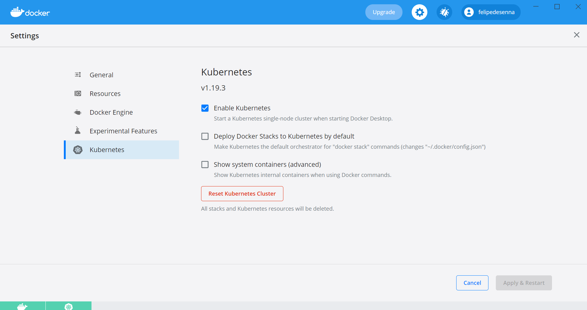

<h3 align="center">
  Variável de ambiente - (ReactJS, Docker, AKS)
</h3>

# Índice

- [Índice](#índice)
  - [:memo: Sobre](#memo-sobre)
  - [:computer: Como usar](#computer-como-usar)
  - [:whale: Docker](#whale-docker)
  - [:ferris_wheel: Kubernetes](#kubernetes)

<a id="sobre"></a>

## :memo: Sobre

O propósito do projeto é criar um template para demonstrar o funcionamento e integração de variáveis de ambiente no ReactJS junto com Docker e AKS.

<a id="como-usar"></a>

## :computer: Como usar

1 - Faça o download ou clone do projeto:

```sh
  $ git clone https://github.com/felipedesenna/react-docker-aks.git
```

2 - Executando o projeto:
Os comandos devem ser executados na raiz do projeto utilizando um terminal (CMD ou Bash)

```sh
  # Instale as dependências do projeto
  $ npm install / yarn

  ## Build da aplicação
  $ npm run build / yarn build
```

Os comandos acima vão criar o build do projeto, esse build vai ser necessário para criar a imagem do docker.

<a id="docker"></a>

## :whale: Docker

Comandos para serem executados na raiz do projeto utilizando um terminal (CMD ou Bash)
1 - Criando a imagem do projeto

```sh
  $ docker build -t react-docker-aks .
```

2 - Criação do registro no Docker local

```sh
  $ docker run -d -p 5000:5000 --restart=always --name registry registry:2
```

3 - Criação de tag para referencia da imagem

```sh
  $ docker tag react-docker-aks localhost:5000/react-docker-aks
```

4 - Fazendo o push da imagem para o Docker local

```sh
  $ docker push localhost:5000/react-docker-aks
```

<a id="kubernetes"></a>

## :ferris_wheel: Kubernetes

Comandos para serem executados na raiz do projeto utilizando um terminal (CMD ou Bash)
1 - Ativando o Kubernetes no Docker-Desktop



2 - Criando o serviço Kubernetes

```sh
  $ kubectl apply -f deployment.yaml
```

3 - Serviço do ambiente staging

```sh
  $ kubectl apply -f deployment-staging.yaml
```

4 - Serviço do ambiente production

```sh
  $ kubectl apply -f deployment-production.yaml
```

Os ambientes ficaram visíveis nas URLs seguintes:

**HLG**
http://localhost:31000/

**STG**
http://localhost:31001/

**PRD**
http://localhost:31002/

- ### **Observação**

  - É **necessário** possuir o **[Node.js](https://nodejs.org/en/download/)** instalado na máquina e para gerenciar os pacotes da aplicação o **[NPM](https://www.npmjs.com/get-npm)** ou **[Yarn](https://yarnpkg.com/getting-started/install)**.
  - Para executar o **Docker** é preciso ter instalado na máquina, você pode fazer o download aqui **[Docker](https://docs.docker.com/docker-for-windows/install/)**.
  - Para executar o **Kubectl** é preciso ter instalado na máquina o **Minikube**, você pode fazer o download aqui **[Minikube](https://minikube.sigs.k8s.io/docs/start/)**.
